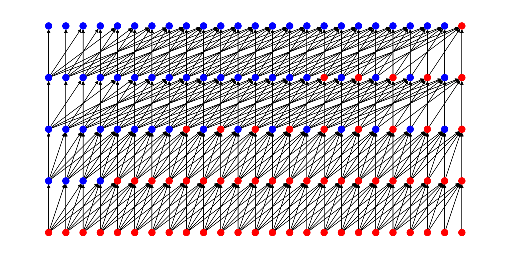

# TCN library (`tcn_lib`)

This is a library for Temporal Convolutional Networks (TCNs) in PyTorch. It is based on the TCN as described in the paper [An Empirical Evaluation of Generic Convolutional and Recurrent Networks for Sequence Modeling](https://arxiv.org/abs/1803.01271) by Shaojie Bai, J. Zico Kolter and Vladlen Koltun. The code is largely based on the [original PyTorch implementation](https://github.com/locuslab/TCN) from the authors.

Compared to the original code base, the following extra features were added:

- Support for batch normalization or/and weight normalization
- Possible to disable residual connections
- Support for ResNeXt blocks
- Support for depthwise separable convolutions
- Removed all possible double biases for optimal training speed (i.e. when using batch normalization)
- Performing [Kaiming](https://pytorch.org/docs/stable/nn.init.html#torch.nn.init.kaiming_uniform_) initialization for ReLU-activated networks
- Initializing batch norm weights to 1.0 and biases to 0.0
- Optionally zero-initially the last batch norm in each block (per https://arxiv.org/abs/1706.02677)
- Small [`stats.py`](src/tcn_lib/stats.py) module to compute TCN properties such its receptive field size

## Installation

```bash
pip install git+https://github.com/V0XNIHILI/TCN-library.git

# Or:

git clone git@github.com:V0XNIHILI/TCN-library.git
cd TCN-library
pip install -e .
```

## Usage

### Model

```python
from tcn_lib import TCN

# Model without linear layer (for regression tasks), by setting output_size to -1
seq_mnist_tcn = TCN(1, -1, [25] * 8, 7)

# Model for sequential MNIST task
seq_mnist_tcn = TCN(1, 10, [25] * 8, 7)

# First 4 layers have kernel size 5, the next 4 layers have kernel size 7
seq_mnist_tcn = TCN(1, -1, [25] * 8, [5] * 4 + [7] * 4)

# Same model, but with batch normalization
seq_mnist_tcn_bn = TCN(1, 10, [25] * 8, 7, batch_norm=True)

# Now also include zero-initializing the last batch norm in each block
seq_mnist_tcn_bn_zi = TCN(1, 10, [25] * 8, 7, batch_norm=True, zero_init_residual=True)

# Same model, but with weight normalization
seq_mnist_tcn_wn = TCN(1, 10, [25] * 8, 7, weight_norm=True)

# Same model, but without residual connections
seq_mnist_tcn_no_res = TCN(1, 10, [25] * 8, 7, residual=False)

# Same model, but with 1x1 convolutions in all residual connections
seq_mnist_tcn_1x1 = TCN(1, 10, [25] * 8, 7, force_downsample=True)

# MNIST classification model with bottleneck blocks
seq_mnist_tcn_bottle = TCN(1, 10, [(64, 256)] * 8, 7, bottleneck=True)

# Same model, but with ResNeXt blocks
mnist_tcn_resnext = TCN(1, 10, [(64, 256)] * 8, 7, bottleneck=True, groups=32)

# Same model but with depthwise separable convolutions
mnist_tcn_depthwise = TCN(1, 10, [(64, 256)] * 8, 7, bottleneck=True, groups=-1)

# Same model, but with dropout
seq_mnist_tcn_dropout = TCN(1, 10, [25] * 8, 7, dropout=0.1)
```

### Statistics

Various small functions to calculate properties such as the receptive field size of a TCN. For a variety of plots based on the properties of a TCN, please refer to [this repository](https://github.com/V0XNIHILI/msc-thesis-plots).

Get the receptive field size of a TCN kernel size 3 and with 4 layers:

```python
from tcn_lib.stats import get_receptive_field_size

receptive_field = get_receptive_field_size(3, 4)  # 61
```

Get the closest (kernel size, number of layers) pair for a required receptive field size of 100:

```python
from tcn_lib.stats import get_kernel_size_and_layers

kernel_size, num_layers = get_kernel_size_and_layers(100)  # (9, 3)
```

Plot a graph of a TCN with kernel size 5 and 2 layers:

```python
import matplotlib.pyplot as plt
import networkx as nx

from tcn_lib.stats import get_kernel_size_and_layers, create_graph

G, pos, color_map = create_graph(5, 2) # Requires networkx pip package installed

plt.figure(figsize=(10, 5))
nx.draw(G, pos, with_labels=False, font_size=7, node_color=color_map, node_size=90) 
plt.show()
```



## License

This project is licensed under the MIT License - see the [LICENSE](LICENSE) file for details.
